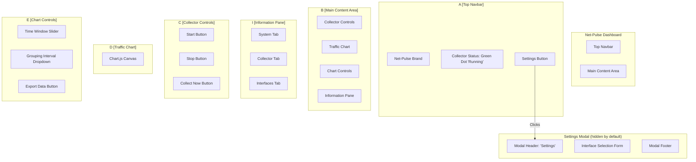

# UI Specification: Net-Pulse Dashboard

This document outlines the user interface design and functionality for the Net-Pulse web dashboard.

## 1. Overall Layout

The UI is a single-page dashboard built with Bootstrap 5. It is organized into a navbar, a main content area, and a modal for settings.

## 2. Component Breakdown

### 2.1. Navbar

- **Description:** A fixed-top Bootstrap navbar for global navigation and status.
- **Components:**
    - **Brand:** Displays "Net-Pulse".
        - **API:** None.
    - **Collector Status Indicator:** Shows the real-time status of the data collector.
        - **API:** `GET /health`, `GET /collector/status`
    - **Settings Button:** A button that opens the Settings Modal.
        - **API:** None (triggers modal).

### 2.2. Main Content Area

- **Description:** The primary workspace for the user.
- **Components:**
    - **Collector Controls:** A Bootstrap button group for managing the data collector.
        - **Start Button:** Starts the collector.
            - **API:** `POST /collector/start`
        - **Stop Button:** Stops the collector.
            - **API:** `POST /collector/stop`
        - **Collect Now Button:** Triggers a single manual collection.
            - **API:** `POST /collector/collect`
    - **Traffic Chart:** A Bootstrap card containing a Chart.js canvas.
        - **Functionality:** Displays time-series data of network traffic (RX/TX).
        - **API:** `GET /api/traffic/history`
    - **Chart Controls:** Controls to customize the chart's data view.
        - **Time Window Slider:** Adjusts the time frame of the data shown.
        - **Grouping Dropdown:** Adjusts the data aggregation interval.
        - **Export Button:** Downloads the current chart data.
            - **API:** `GET /api/export/traffic`
    - **Live Speed Indicator:** Displays the latest network speed.
        - **API:** `GET /api/traffic/latest`

### 2.3. Information Pane

- **Description:** A Bootstrap tab component below the chart to show detailed information.
- **Components:**
    - **System Tab:**
        - **Functionality:** Displays application info, system health, and metrics.
        - **API:** `GET /`, `GET /api/system/info`, `GET /api/system/health`, `GET /api/system/metrics`
    - **Collector Tab:**
        - **Functionality:** Displays detailed status and configuration of the collector.
        - **API:** `GET /collector/status`, `GET /api/config/collection-interval`
    - **Interfaces Tab:**
        - **Functionality:** Lists all available network interfaces. Clicking an interface shows detailed stats.
        - **API:** `GET /api/interfaces`, `GET /api/interfaces/{interface_name}`, `GET /api/interfaces/{interface_name}/stats`, `GET /api/traffic/summary`

### 2.4. Settings Modal

- **Description:** A Bootstrap modal for application configuration.
- **Components:**
    - **Interface Selection Form:** A list of checkboxes for all available interfaces.
        - **Functionality:** Allows users to select which interfaces to monitor.
        - **API:** `GET /api/interfaces`, `GET /api/config/interfaces`, `PUT /api/config/interfaces`
    - **Collection Interval Input:** A number input to set the polling interval.
        - **Functionality:** Allows users to change the data collection frequency.
        - **API:** `GET /api/config/collection-interval`, `PUT /api/config/collection-interval`
